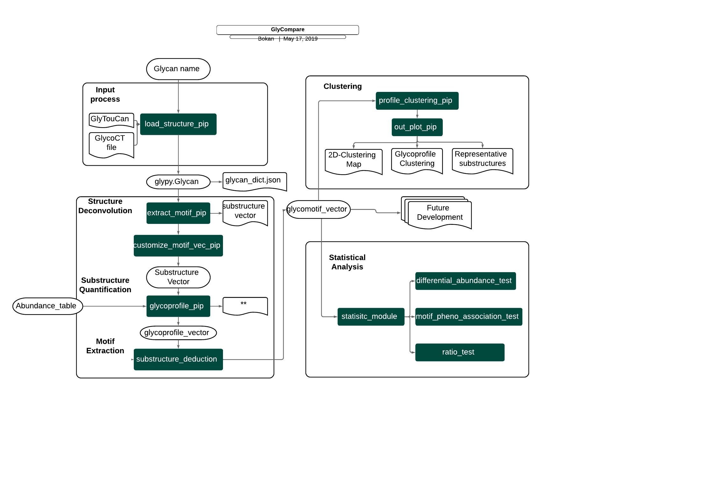

# GlyCompare

Here, we present GlyCompare, a novel method wherein glycans from glycomic data are decomposed to a minimal set of intermediate substructures, thus incorporating shared intermediate glycan substructures into all comparisons of glycans. 

## Citation

Bokan Bao+, Benjamin P. Kellman+, Austin W. T. Chiang, Austin K. York, Mahmoud A. Mohammad, Morey W. Haymond, Lars Bode, and Nathan E. Lewis. 2019. “**Correcting for Sparsity and Non-Independence in Glycomic Data through a System Biology Framework.**” bioRxiv. https://doi.org/10.1101/693507.

<!---



## Disclaimer:

The GlyCompare framework provides several tools that account for the influence of the glycan substructure network in the analysis of glycomic data. However, for its effective use, there are two primary requirements for the data it processes. First, the tools require that the glycan is stored in a tree-like structure. Thus, neither cyclic nor glycan with undefined topology in glycoCT format can be processed. Second, during the substructure matching, in terms of the linkage specificity, the code can only handle two types of substructure analysis. One has the exact linkage specification, and one ignores all linkage specification and only accounts for topology. Currently, our tool cannot handle partial ambiguity in linkages of a glycan. The code and the manual are freely available and will be continually developed to enable its accessibility to all types of scientists. 


## Definition and nomenclature for variables in Glycompare:
  - Each keyword represents a defined type of variable. 

### Glycan Part:
- **glycan_**
  - type: a glycan object. The object of gly.structure.glycan.glycan
  
- **glycan_dict**
  - type: dict. key is **glycan_id**. glycan_dict[glycan_id]=**glycan_**.
  
- **glycan_list**
  - type: list (of **glycan_**). 
  
- **glycan_id**
  - type: str. String ID used for a **glycan_**.
  
- **glycan_str**
  - type: str. glycoct structure of a **glycan_**. Generated by str(**glycan_**).
  
- **glycan_str_dict**
  - type: str. key is **glycan_id**. glycan_str_dict[glycan_id]=str(**glycan_**).
  
- **mz**
  - type: str. Annotated m/z for a **glycan_**

- **motif_(substructure)**
  - type: a glycan object. The object of gly.structure.glycan.glycan. Just a substructure that breaking down from **glycan_**.
  
- **motif_id** 
  - type: str. String index ID used for a **glycan_**.

- **motif_vec**
  - type: list (of **motif_**). A list of **glycan_** type obj. A list of substructures that breaking down from **glycan_**.

- **motif_dict**
  - type: dict. Key is the degree of **motif_**. motif_dict\[key\] is a **motif_vec**.

- **glycan_motif_dict**
  - type: dict. Key is the str(glycan_id). glycan_motif_dict\[glycan_id\] is a **motif_dict**.
  
- **match_vec**
  - type: list (of float). length = len(motif_vec), The existency(0/1/1+) within a **glycan_** for each **motif_** in **motif_vec**
  
- **match_dict**
  - type: dict. Key is the glycan_id. match_dict\[glycan_id\] is a **match_vec**
  
- **match_mtrix**
  - type: 2D list (of float). List size: number of **glycan_**; Sublist size: len(**motif_vec**); simply a list of **match_vec**
  
### Distinguish the variables that have same type.
   - glycan_1, glycan_2 mean two different **glycan_**
   - motif_1, motif_2 mean two different **motif_**
  
### Glycan IO Part:
   - All glycan_ obj will be stored with glycoct format.
   - GlycoCT: 
    
    ```
    from glypy.io import glycoct
    glycan_ = glycoct.loads(json_load(target_address)) 
    json_store(target_address, str(glycan_))
    ```
  
### Glycoprofile Part
- **mz_to_id_dict**
  - type: dict. Key: m/z. mz_to_glycan_id\[m/z\]=glycan_id
 
- **profile_mz_to_id**
  - type: dict. Key: glycoprofile id. profile_mz_to_id\[id\]=**mz_to_id_dict**

- **mz_abd_table**
  - type: pandas table. columns: each profile. row: m/z

- **glycan_abd_table**
  - type: pandas table. columns: each profile. row: glycan
  
- **motif_abd_table**
  - type: pandas table. columns: each profile. row: glycan
  
- **relative_abundance**
  - type: list (of float). Sum to 1. Relative abundance for each annotated glycan in a glycoprofile.

- **weighted_vec**
  - type: list (of float). = match_mtrix.T * relative_abundance
  
- **_class_** **glycoprofile()**:
  - glycan_id_list: 
    - type: list. A list of glycan_id.
  
  - mz_list: 
    - type: list. A list of m/z for each glycan_.
  
  - weighted_vec: 
    - as mentioned
  
  - .relative_abundance: 
    - as mentioned
  
  


## Basic Workflow

### Conversion of glycans to motif space

Given different glycan representations, we will use glypy to translate these into motif space

- GlycoCT: 
=======
Bokan Bao+, Benjamin P. Kellman+, Austin W. T. Chiang, Austin K. York, Mahmoud A. Mohammad, Morey W. Haymond, Lars Bode, and Nathan E. Lewis. 2019. “****Correcting for Sparsity and Non-Independence in Glycomic Data through a Systems Biology Framework.****” bioRxiv. https://doi.org/10.1101/693507.
--->

### Demonstrations & Manuscript Analyses
- **Code Ocean Compute Capsule**
  - [ EPO & HMO glyco-motif examples (provisional DOI)](https://doi.org/10.24433/CO.9148600.v1)
- **Jupyter Notebooks**
  - [All demos](https://github.com/LewisLabUCSD/GlyCompare/tree/master/example_notebook)
  - [Figure 2 & 3, glycoprofile processing and analysis](https://github.com/LewisLabUCSD/GlyCompare/blob/master/example_notebook/Fig2_Fig3_epo_analysis.ipynb)
  - [Figure 4 & 5, glycoprofile processing](https://github.com/LewisLabUCSD/GlyCompare/blob/master/example_notebook/Fig4_Fig5_hmo_analysis.ipynb)
  - [Figure 4 & 5, glycoprofile analysis](https://github.com/LewisLabUCSD/GlyCompare/blob/master/example_notebook/Fig4_Fig5_hmo_stats.ipynb)

## Installation (2-10 minutes)

Glycompare was developed and tested in `Mac OS X` and `Ubuntu 18.04`

Requirements and dependencies
- python 3+
- glypy
- anaconda3 (for cython, pandas, numpy, seaborn, networkx==2.1, ndex, xlrd==1.2)
- git-lfs (can be installed with homebrew or ```sudo apt install git-lfs```


<!-- Glycompare can be installed directly from pip using
```pip3 install glycompare```
-->

#### Install from github
The package can also be installed locally using


```bash
# get the repo
git clone https://github.com/LewisLabUCSD/GlyCompare.git
# enter the repo
cd GlyCompare
# get the large files (~150MB including the glycompare db [glytoucan_db_addr])
git lfs pull
# install glycompare
python3 setup.py install
```

If you don't have ```sudo``` privileges, you can run a local install by adding the ```--user``` tag to the install
```
python3 setup.py install --user
```

If git lfs or the install fails, follow these alternative instructions for install: https://github.com/LewisLabUCSD/GlyCompare/wiki#install-glycompare

<!--
#### Install from PyPI

To install via PyPI, using pip3

```bash
# install glycompare
pip3 install glycompare

# download the glytoucan db (the path to this db is glytoucan_db_addr)
wget https://github.com/LewisLabUCSD/GlyCompare/blob/master/glycompare/database/glytoucan_database.json
```
-->

# Pipeline Overview


## Quick Example (2-10 minutes)

A quick run through the top-level functions using the [CHO-EPO data](https://github.com/LewisLabUCSD/GlyCompare/blob/master/example_notebook/Fig2_Fig3_epo_analysis.ipynb)
```python3
import os
import pandas as pd
import seaborn as sns
import matplotlib.pyplot as plt
import numpy as np
from copy import deepcopy
from scipy.stats import yeojohnson, probplot, wilcoxon, norm
from scipy import stats

from glycompare import *

# parameter setting 
# environment parameter setting 
glycompare_addr = '<PATH_TO_GLYCOMPARE>/GlyCompare/'
glytoucan_db_addr = os.path.join(glycompare_addr, 'glycompare','database', 'glytoucan_database.json')
linkage_specific = False
num_processors = 8
# project parameter
working_addr = os.path.join(glycompare_addr,'paper_epo/')
project_name = "paper_epo"
costumized_glycan_identifier = True
external_profile_naming= True
rerun = False 

# initiator
keywords_dict = pipeline_functions.load_para_keywords(project_name, working_addr, glytoucan_db_addr=glytoucan_db_addr)
keywords_dict

pipeline_functions.check_init_dir(keywords_dict)
##

## initialize glycans
meta_name = pd.read_csv(os.path.join(working_addr,'source_data','glycan_id_list.txt'), sep='\t')
structure_loader = meta_name['glycan_id'].tolist()
data_type = 'mix'
glycan_dict = pipeline_functions.load_glycans_pip(keywords_dict=keywords_dict,
                                           data_type=data_type, 
                                           structure_loader=structure_loader)

## extract substructure and generate substructure vector
matched_dict = pipeline_functions.extract_and_merge_substrutures_pip(keywords_dict, num_processors=num_processors,linkage_specific=linkage_specific, forced=rerun)

## calculate substructure abundance -> glycoprofile vector 
abd_table = glycan_io.load_table(os.path.join(keywords_dict['source_dir'], 'abundance_table.xls'))
_, glycoprofile_list = pipeline_functions.glycoprofile_pip(keywords_dict, 
                                                           abd_table, 
                                                           unique_glycan_identifier_to_structure_id=False, 
                                                           already_glytoucan_id=False,
                                                           external_profile_naming=True, 
                                                           forced=rerun)

_name_dict = json_utility.load_json(keywords_dict['source_dir']+'external_profile_naming.json')
selected_name_list = ["EPO127.mgat1.","EPO174.mgat2.","EPO266.fut8.","st3gal4.st3gal6.mgat4a.mgat4b.mgat5",
  "KI_ST6GalNAc1.st3gal4.st3gal6.mgat4a.mgat4b.mgat5","mgat4A.mgat4B.mgat5","B3gnt2.mgat4a.mgat4b.mgat5",
  "st3gal4.st3gal6","B4GalT1","B4GalT2","B4GalT3","WT","B4GalT4","EPO78.mgat4B.","mgat4A.mgat4B","mgat5"]

select_col=[]
_ = {}
for i,j in _name_dict.items():
    _[j] = i
    
for i in selected_name_list:
    select_col.append(_[i])
print(select_col)
feature_name = []
profile_name = []

selected_profile = [30, 25, 34, 21, 22, 5, 20, 18, 6, 7, 8, 1, 9, 28, 3, 4]
for i in selected_profile:
    profile_name.append(_name_dict[str(i)])
    for j in glycoprofile_list[i-1].glycan_id_list:
        feature_name.append(j)

feature_name = list(set(feature_name))
## select motif and get motif abundance -> glyco-motif vector
core=select_motifs.nglycan_core
motif_abd_table, motif_lab, merged_weights_dict=pipeline_functions.select_motifs_pip(keywords_dict, 
                                                     linkage_specific=linkage_specific,   
                                                     core=core,
                                                     only_substructures_start_from_root=True,
                                                     select_col= select_col)

## cluster and determine representative motifs
glycoprofile_cluster_dict, glyco_motif_cluster_dict = pipeline_functions.clustering_analysis_pip(keywords_dict=keywords_dict, 
                                           motif_abd_table=motif_abd_table, 
                                           select_profile_name = selected_name_list)


pipeline_functions.draw_substructure_representative_pip(glyco_motif_cluster=glyco_motif_cluster_dict,
                                                        substructure_vec=motif_lab.motif_vec,
                                                        motif_weights_dict=merged_weights_dict,
                                                        plot_all_substructure=False,
                                                        address_dir=keywords_dict['plot_output_dir'],
                                                        threshold=0.51,
                                                        plot_rep=True)

```

## Disclaimer:

The GlyCompare framework provides several tools that account for the influence of the glycan substructure network in the analysis of glycomic data. However, for its effective use, there are two primary requirements for the data it processes. First, the tools require that the glycan is stored in a tree-like structure. Thus, neither cyclic nor glycan with undefined topology in glycoCT format can be processed. Second, during the substructure matching, in terms of the linkage specificity, the code can only handle two types of substructure analysis. One has the exact linkage specification, and one ignores all linkage specification and only accounts for topology. Currently, our tool cannot handle partial ambiguity in linkages of a glycan. The code and the manual are freely available and will be continually developed to enable its accessibility to all types of scientists. 

------------
------------
------------

# Complete Description of Environment setup & Pipeline Functions

Glycompare provides several complete pipelines that several major pre-prescribed functions of Glycompare. 

### Create a new session and all data are required in ./source_data/

1.1. abundance_table.xls. An abundance_table has column: sample (glycoprofile), row: glycan (the glycan identifier can be glytoucan_id or custimized: m/z, hplc). An abundance table (1.1) is necessary to run the full GlyCompare pipeline, if the glytoucan_id for each glycan is specified. For example, [iscience_data](https://github.com/LewisLabUCSD/GlyCompare/blob/master/example_data/test_iscience/source_data/abundace_table.csv). Complex data need more, [epo_data](https://github.com/LewisLabUCSD/GlyCompare/blob/master/example_data/paper_epo/source_data/).
    
    

1.2. (optional) external_profile_naming.json. Glycompare defaults to index names for each sample (e.g. 1,2,3). If you want to specify a name for each sample use. i.e. [paper_epo/source_data/external_profile_naming.json](https://github.com/LewisLabUCSD/GlyCompare/blob/master/example_data/paper_epo/source_data/external_profile_naming.json)
    
    

1.3. (optional) glycan_identifier_to_glytoucan_id.json. If the glycan identifiers in abundance_table.xls are glytoucan_id or m/z which map uniquely (1:1) to glytoucan IDs, this file can be ignored. If m/z can map to multiple isoforms, this file must be completed to specify which m/z correspond to which structures  [paper_epo/source_data/glycan_identifier_to_glytoucan_id.json](https://github.com/LewisLabUCSD/GlyCompare/blob/master/example_data/paper_epo/source_data/glycan_identifier_to_glytoucan_id.json)
    
    
1.4. (optinal) source_data/glycoct/. If part of glycan structures are manually curated, we need a source_data/glycoct/ directory to store all of them (i.e. [paper_epo/source_data/glycoct](https://github.com/LewisLabUCSD/GlyCompare/tree/master/example_data/paper_epo/source_data/glycoct))


### There are several parameter should be set up first

2.1. working_addr : root working dir

2.2. project_name: usually same as the folder of root

2.3. __init__.num_processors: number of processes needed

2.4. glytoucan_db_addr: the addr for glytoucan database if needed
- meta_name: a gff type table which includes glycan's naming information


## Initialization

Pipeline functions include: ```load_glycan_pip```, ```extract_and_merge_substructures_pip```, ```glycoprofile_pip```, ```select_motifs_pip```, ```clustering_analysis_pip```
Most require a set of core inputs we centralize in the ```keyword_dict``` which can be initialized using the load parameter function.

### ```load_para_keywords```
**Description**: Create a dictionary to maintain consistent working directories, filenames and project names throughout the analysis.

**Input:**
- project_name: string, a name for the analysis to be performed
- working_addr: string, the working directory where you would like the analysis to be saved
- kwargs: any additional analysis variables you would like to set

**Output:**
- keywords_dict: dictionary, containing environment variables to be used throughout the analysis

**Example:**
From the [isience example](https://github.com/LewisLabUCSD/GlyCompare/blob/master/example_notebook/test_iscience.ipynb)
```
# environment parameter setting
glytoucan_db_addr = os.path.join( 'glycompare','database', 'glytoucan_database.json')
# project parameter
working_addr = os.path.join( 'example_data', 'test_iscience')
project_name = "test_iscience"                                                                          
keywords_dict = pipeline_functions.load_para_keywords(project_name, working_addr, glytoucan_db_addr=glytoucan_db_addr) 
```

## Input process

### ```load_glycans_pip```

**Description:** Load glycans from glycoprofile using glytoucan database (data_type='glytoucanid') or local glycoct structure (data_type='local_glycoct') or both (data_type='mix'). Glycoct structures will be read from ```source_data/glycoct/``` folder in the source_data directory (i.e. [paper_epo/source_data/glycoct](https://github.com/LewisLabUCSD/GlyCompare/tree/master/example_data/paper_epo/source_data/glycoct)). Returns a glycan_dict object, a dictionary of glypy.Glycan objects with glytoucan and m/z as keys.

**Input:**
- keywords_dict: dict, keyword pipeline variable dictionary from ```load_para_keywords``` function
- data_type: string, either ['used', 'glycan_dict', 'glytoucanid', 'local_glycoct', 'mix'] indicating which method should be used to load and initilize the glypy.glycan objects. If ```data_type=='local_glycoct'``` or ```data_type=='mix'```, then the user must add glycoct files to the ```source_data/glycoct/``` folder in the source_data directory (i.e. [paper_epo/source_data/glycoct](https://github.com/LewisLabUCSD/GlyCompare/tree/master/example_data/paper_epo/source_data/glycoct)).
- structure_loader: a list of glycan name/customized id, or a glycan_dict

**Output:**
- glycan_dict: dict, glypy.Glycan objects with glytoucan and/or m/z as keys.


**Approach:**
```
if data_type=='used': # load from a local glycan_dict json
    -> json file already exists in the working directyr 
if data_type=='glycan_dict': # load from an existing glycan_dict in the local environment (check the glycan_dict obeject)
    -> (already in the enviroment) glycan_dict already exists
if data_type=='glytoucanid': # load from the glytoucan database using glytoucan ids to retrieve the glycoct structure
   :param load from glytoucan database (glytoucan_database_addr)
if data_type=='local_glycoct': # load from local glycoct files
    :param load from local glycoct files (glycoct_dir)
if data_type=='mix': # load from both local glycoct and glytoucanid
    :param glycoct_dir & glytoucan_database_addr (glytoucanid & local_glycoct)
```


The motif-abundance matrix is the dot product of the glycan abundance matrix (abundance of each glycan in each sample, sample x glycan) and the glycan-motif occurance matrix (number of occurances of each motif in each glycan, glycan x motif)
```


## comparison across enzyme isoform
# extract motifs
glycanMotifMatrix1 = np.matrix( [mapMotifs( extractMotifs( g1 ) , motifsVector = motifVector ) for g1 in glycanList1 ] )
glycanMotifMatrix2 = np.matrix( [mapMotifs( extractMotifs( g2 ) , motifsVector = motifVector ) for g2 in glycanList2 ] )
# abunance weighted motif vector
glycanMotifVectorAbundance1 = glycanMotifMatrix1%*%abundance1
glycanMotifVectorAbundance2 = glycanMotifMatrix1%*%abundance2
# all motif vector
glycanMotifVector1 = numpy.sum( glycanMotifMatrix1 , axis=1)
glycanMotifVector2 = numpy.sum( glycanMotifMatrix2 , axis=1)
=======
```

**Example:**

From the [isience example](https://github.com/LewisLabUCSD/GlyCompare/blob/master/example_notebook/test_iscience.ipynb)
```
keywords_dict = pipeline_functions.load_para_keywords("test_iscience", "example_data/test_iscience", glytoucan_db_addr='glycompare/database/glytoucan_database.json') 
_table = glycan_io.load_table(os.path.join('example_data/test_iscience/source_data', 'abundace_table.csv'), rep='-')
structure_loader = _table.columns.tolist() # get glytoucan ids
glycan_dict = pipeline_functions.load_structure_pip(keywords_dict=keywords_dict,
                                           data_type='glytoucanid', 
                                           structure_loader=structure_loader)
```

From the [cho epo example](https://github.com/LewisLabUCSD/GlyCompare/blob/master/example_notebook/Fig2_Fig3_epo_analysis.ipynb)
```
keywords_dict = pipeline_functions.load_para_keywords("paper_epo", "example_data/paper_epo", glytoucan_db_addr='glycompare/database/glytoucan_database.json') 
meta_name = pd.read_csv(os.path.join('example_data/paper_epo/source_data','glycan_id_list.txt'), sep='\t')
structure_loader = meta_name['glycan_id'].tolist()
glycan_dict = pipeline_functions.load_structure_pip(keywords_dict=keywords_dict,
                                           data_type='mix', 
                                           structure_loader=structure_loader)
```


## Structure deconvolution, quantification and motif extraction

### ```extract_and_merge_substructures_pip```

**Description:** Loads observed glycans (```extract_substructures.extract_substructures_pip```), identifies substructures in each glycan then merges all substructures into a reference substructure vector (```merge_substructure_vec.merge_substructure_dict_pip```), and maps all input glycans to the merged substructure vector to determine the number of times each substructure appears in each glycan (```merge_substructure_vec.substructure_matching_wrapper```). 

**Input:**
- keywords_dict: dict, keyword pipeline variable dictionary from ```load_para_keywords``` function. ```extract_and_merge_substructures_pip``` will locate the glycans to process in the ```source_data``` directory using the ```keywords_dict```.
- linkage_specific: boolean, if True, ```extract_and_merge_substructures_pip``` will leverage linkage information. If False, ```extract_and_merge_substructures_pip``` will run without linkage information. Do not set ```linkage_specification=True``` if this information is not supported by your measurement, this will result in unpredictable behavior. 
- num_processors: integer that specifies the number of CPU to use.
- forced: boolean, defaults to False. If False, ```extract_and_merge_substructures_pip``` will not run if the output file already exists. If True, ```extract_and_merge_substructures_pip``` will run and overwrite the existing output file.

**Output:**
- matched_dict: dict, mapping from observed glycans (keys) to a ```substructure_present_absent_vector``` (e.g. [matched_dict.json](https://github.com/LewisLabUCSD/GlyCompare/blob/master/example_data/paper_epo/intermediate_file/paper_epo_matched_dict.json)). The ```substructure_present_absent_vector``` indicates the number of times each substructure occurs in a glycan. The i-th substructure referenced in the ```substructure_present_absent_vector``` matches the i-th substructure in the ```substructure_vec``` which contains the glycoct for each substructure. #The ```substructure_vec``` is returned by ```glycan_io.motif_dict_to_motif_vec(substructure_vector_dict)```. 

<!-- extract_and_merge_substructures_pip,
    - Is "motif occurance vector" the correct term? What do we call this?
    - We should talk about a simpler way to explain the motif occurance vector. Could we just output the motif occurance vector instead of outputing the motif_dict? Or could we output a substructure_vector_matrix with glycans in the columns and substructure in the rows then number of occurances would be the values in the matrix? That could be a lot clearer
-->

**Example:**

From the [cho epo example](https://github.com/LewisLabUCSD/GlyCompare/blob/master/example_notebook/Fig2_Fig3_epo_analysis.ipynb)
```
keywords_dict = pipeline_functions.load_para_keywords("paper_epo", "example_data/paper_epo", glytoucan_db_addr='glycompare/database/glytoucan_database.json') 

substructure_vector_dict=pipeline_functions.extract_and_merge_substructures_pip(keywords_dict, linkage_specific=False, forced=False)

# get all the substructures present in the 1st observed glycan
gt0=substructure_vector_dict[substructure_vector_dict.keys()[0]]>0
present_substructures=glycan_io.motif_dict_to_motif_vec(substructure_vector_dict)[gt0]
```

### ```glycoprofile_pip``` (aka abd_table_pip)

**Description:** Loads glycoprofiles (glycan abundance) and calculates the glycoprofile_vector_table (substructure abundance)

**Input:**
- keywords_dict: dict, keyword pipeline variable dictionary from ```load_para_keywords``` function
- abd_table: string, filename pointing to the glycan abundance table. The loader will handel csv and xls tables. 
Row names are m/z, glytoucan ids, or custom glycan ids specified in ```glycan_identifier_to_glytoucan_id.json```. in the source_data directory (i.e. [paper_epo/source_data/glycan_identifier_to_glytoucan_id.json](https://github.com/LewisLabUCSD/GlyCompare/tree/master/example_data/paper_epo/source_data/glycan_identifier_to_glytoucan_id.json)).
Column names will be ignored, to name sample/glycoprofiles the user must specify ``` external_profile_naming.json``` in the source_data directory (i.e. [paper_epo/source_data/external_profile_naming.json](https://github.com/LewisLabUCSD/GlyCompare/tree/master/example_data/paper_epo/source_data/external_profile_naming.json)).
- simple_profile: boolean, defaults to False. If False, ```glycoprofile_pip``` will search for ```source_data/glycan_identifier_to_glytoucan_id.json``` to determine the names of glycans in the glycoprofile. If True, glycan structure will be read from the table. If glycans are identified by m/z in the abundance table and there is not a 1:1 mapping from m/z to glycan structure, ```simple_profile``` must be False.
- unique_glycan_identifier_to_structure_id: boolean, defaults to False. If this variable and ```already_glytoucan_id``` are set to True, ```glycoprofile_pip``` will run using the using the GlyTouCanIDs in the abundance table. Otherwise, ```glycan_identifier_to_glytoucan_id.json.``` will be read to name the glycoprofiles/samples.
- already_glytoucan_id: boolean, defaults to False. If False, glycan structure will be read from the glytoucan database using glytoucan IDs from the abundance table. If True, the glycan identifiers specified in the abundance table must be read in separately
- forced: boolean, defaults to False. If False, ```glycoprofile_pip``` will not run if the output file already exists. If True, ```glycoprofile_pip``` will run and overwrite the existing output file.
<!-- glycoprofile_pip
    Double check definitions of simple_profile & simple_naming, are they the same as any of the initial variable? 
-->

**Output:**
- glycoprofile_vector_table: double matrix, containing substructure abundance. Row names are substructures and column names are glycoprofiles/samples.

**Example:**

From the [cho epo example](https://github.com/LewisLabUCSD/GlyCompare/blob/master/example_notebook/Fig2_Fig3_epo_analysis.ipynb)
```
keywords_dict = pipeline_functions.load_para_keywords("paper_epo", "example_data/paper_epo", glytoucan_db_addr='glycompare/database/glytoucan_database.json') 
abd_table = glycan_io.load_table(os.path.join(keywords_dict['source_dir'], 'abundance_table.xls'))
glycoprofile_vector_table=pipeline_functions.glycoprofile_pip(keywords_dict, abd_table, external_profile_naming=True, forced=False)
```

### ```select_motifs_pip``` (from substructure_deduction, aka motif_vec_pip)

**Description:** Examines the glyan and substructure abundance tables and the substructure network to determine the minimal set of meaningful substructures. We term the minimal set of sufficiently meaningful substructure, "motifs."

**Input:** 
- keywords_dict: dict, keyword pipeline variable dictionary from ```load_para_keywords``` function
- linkage_specific: boolean, if True, ```extract_and_merge_substructures_pip``` will leverage linkage information. If False, ```extract_and_merge_substructures_pip``` will run without linkage information. Do not set ```linkage_specification=True``` if this information is not supported by your measurement, this will result in unpredictable behavior. If True, ```extract_and_merge_pip``` will run with all sunstructures including the root/core substructure. If False, all substructures will be considered. 
- core: glycot string describing the root sunbstructure
- drop_parellel: boolean, defaults to False. If True, ```extract_merge_substructures``` will run  dropping the smaller-degree fewer monosaccharides substructure even if they do not have a parent/child relationship.
- drop_diff_abundance: boolean, defaults to True. If True, ```extract_merge_substructures``` will run dropping the parent if the parent's abundance is close to the children's abundance 
- select_col: list, defaults to an empty list. It should be the columns passed into the substructure_abd_table for getting substructure weight
- remove_core: boolean, defaults to True.  If True, ```extract_merge_substructures``` will run with the motif set excluding the provided core. If False, the core is included. 

**Output:**

- motif_abd_table: real matrix, a matrix of motif abundances with motifs in the rows and samples in the columns.
- a_node_state: select_motifs.NodesState object, containing the abundance information and substructure connectivity

<!-- select_motifs_pip
    - Double check definitions of epitope, did I flip the true/false definitions? 
    - Would it be okay if we moved ln396-404 from cluster_analysis_pip to select_motif_pip? If we did this then select_motif_pip would output the motif abundance matrix (which is the implication of the lucidchart figure and makes sense to me) and cluster_analysis_pip would do the clustering. This seems a little easier to follow. 
    - which line in cluster_analysis_pip extracts/returns the "representative substructures"
-->

**Example:**
From the [cho epo example](https://github.com/LewisLabUCSD/GlyCompare/blob/master/example_notebook/Fig2_Fig3_epo_analysis.ipynb)
```
keywords_dict = pipeline_functions.load_para_keywords("paper_epo", "example_data/paper_epo", glytoucan_db_addr='glycompare/database/glytoucan_database.json') 

abd_table = glycan_io.load_table(os.path.join(keywords_dict['source_dir'], 'abundance_table.xls'))
glycoprofile_vector_table=pipeline_functions.glycoprofile_pip(keywords_dict, abd_table, external_profile_naming=True, forced=False)
motif_abd_table,a_node_state = pipeline_functions.select_motifs_pip(keywords_dict, linkage_specific=linkage_specific, epitope=True)
```

## Clustering
### ```clustering_analysis_pip```

**Description:** Clusters the motif abundance table and extracts representative motifs for each cluster

**Input:**
- keywords_dict: dict, keyword pipeline variable dictionary from ```load_para_keywords``` function
- motif_abd_table: real matrix, a matrix of motif abundances with motifs in the rows and samples in the columns.

**Plot:**
- substructure_representative:
- glycoprofile_cluster:
- rep_str: dict, dictionary of representative structures
- raw_abd_zscore_plot: figure, a biscluster of substructure abundance saved at 'raw_abundance_zscore.eps' 


**Example:**
From the [cho epo example](https://github.com/LewisLabUCSD/GlyCompare/blob/master/example_notebook/Fig2_Fig3_epo_analysis.ipynb)
```
keywords_dict = pipeline_functions.load_para_keywords("paper_epo", "example_data/paper_epo", glytoucan_db_addr='glycompare/database/glytoucan_database.json') 

abd_table = glycan_io.load_table(os.path.join(keywords_dict['source_dir'], 'abundance_table.xls'))
glycoprofile_vector_table=pipeline_functions.glycoprofile_pip(keywords_dict, abd_table, external_profile_naming=True, forced=False)
motif_abd_table = pipeline_functions.select_motifs_pip(keywords_dict, linkage_specific=linkage_specific, epitope=True)
pipeline_functions.profile_cluster_pip(keyworks_dict,motif_abd_table)
```

## Statistical Analysis 
Statistical analyses are not yet incorperate in the package. The analysese performed can be found at [example_notebook/Fig4_Fig5_hmo_stats.r](https://github.com/LewisLabUCSD/GlyCompare/blob/master/example_notebook/Fig4_Fig5_hmo_stats.ipynb)

